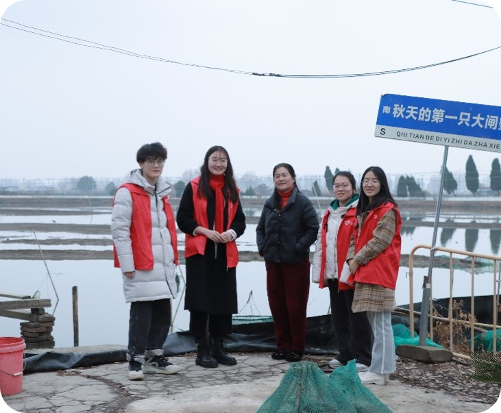

党的二十大报告指出，加快建设农业强国，扎实推动乡村产业、人才、文化、生态、组织振兴。文化既是凝聚力量的精神纽带、推动发展的重要支撑，又直接关系民生福祉、关系人的全面发展。我国五千年的中华文明源远流长、博大精深，承载着中华民族生生不息的基因密码，其所涵养、传承、生发的农耕文化，凝聚着中华民族最深层的思想智慧，维系着中华民族最深层的集体记忆，也镌刻着中华民族最深层的精神标识，是中华优秀传统文化的精神根脉，是维持乡村社会秩序有效运行的内在基础。可以说，乡村文化振兴，既是文明传承的必然选择，又是乡村发展的题中之义。以产业的形式推动文化加快发展，是发挥文化“精神推动力”和“物质发展力”的有效途径。“文化产业赋能乡村振兴计划”是实现脱贫攻坚后，党中央、国务院作出的重大部署，是为乡村振兴注入新动能的重大工程。文化和旅游部等六部门联合印发的《关于推动文化产业赋能乡村振兴的意见》，旨在将文化产业赋能乡村振兴纳入全面推进乡村振兴整体格局，充分发挥文化产业优结构、扩消费、增就业、促转型、可持续的独特作用，助力乡村经济社会发展，助力实现巩固拓展脱贫攻坚成果同乡村振兴有效衔接，推动乡村产业兴旺、生态宜居、乡风文明、治理有效、生活富裕。

党的二十大报告明确指出高质量发展是全面建设社会主义现代化国家的首要任务，中国共产党的中心任务就是团结带领全国各族人民全面建成社会主义现代化强国、实现第二个百年奋斗目标，以中国式现代化全面推进中华民族伟大复兴。中国式现代化既有世界各国现代化的共性，又有自身的独特性，中国式现代化的实现离不开农业农村的现代化，全面建设社会主义国家，最艰巨最繁重的任务仍然在乡村。推动中国式农业农村现代化，必然离不开乡村产业的高质量发展,产业兴旺是实现乡村振兴的重要基础,更是实现中国式农业农村现代化的重要抓手。中国式农业农村现代化必然也是着眼于乡村人口规模巨大、实现共同富裕、物质文明与精神文明相协调、人与自然和谐共生的现代化。乡村旅游在助力中国式农业农村现代化中将发挥重要带动作用乡村旅游作为旅游产业的重要组成部分和乡村特色产业成为新时期推动产业融合、增加农民收入和践行两山理论的重要新兴业态。在脱贫攻坚战中，乡村旅游通过对乡村绿水青山资源的保护性利用,不仅为贫困地区增添了产业发展动力，更是成为农民脱贫致富的重要路径,是扶贫战场不可忽视的中坚力量，为摆脱绝对贫困贡献了旅游力量。

针对中老年蟹农在收蟹期间，由于缺少休息空间和时间，而导致的健康问题。在推进乡村振兴的多种路径中，乡村文化旅游是推动乡村经济与文化协同发展的重要路径之一。乡村旅游对提高农民收入、增加农民就业、改善乡村环境、保护乡村文化遗产、提升农民素质有重要作用。大力融合乡村文化与乡村旅游，借力信息技术，创建具备特色性的乡村结构体系。

 

 
