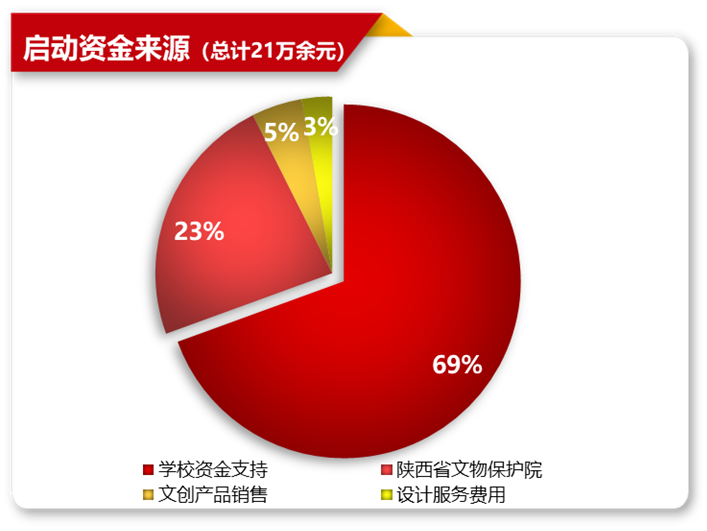
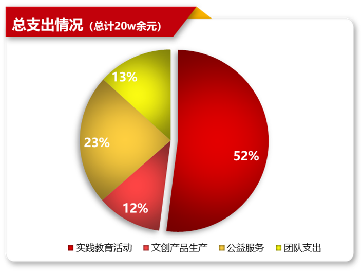

## 启动资金来源

“蟹蟹有你”目前总收入为23.6万元，主要来源于学校资金支持、南京市高淳政府、南京市博物馆赞助及文创产品销售与设计服务所得。工作室创立之初，学校支持启动资金15万元，后项目获得陕西省文物保护院认可，得到5万元用于后续项目建设，其后一段时间，我工作室累计获得文创产品销售额3万元，设计服务费用0.6万元。

## 文创产品销售预测

表6.1预计未来3年收入预测表（单位：元）

| 销售渠道     | 2021年   | 2022年   | 2023年   |
| ------------ | -------- | -------- | -------- |
| 校园义卖     | 800.00↑  | 1500.00↑ | 2500.00↑ |
| 网络电商     | 850.00↑  | 3000.00↑ | 4500.00↑ |
| 产品地推     | 500.00↑  | 1000.00↑ | 1500.00↑ |
| 收入额总计   | 2150.00↑ | 5500.00↑ | 8500.00↑ |
| 收入增长率   | /        | 155.81%  | 54.54%   |
| 支持（政府） | 0.00     | 3600.00↑ | 5000.00↑ |

注：“↑”表示具备一定上涨空间

## 资金支出预测

“蟹蟹有你”项目目前累计支出20.3万元，用于公益服务、文化实践教育、文创产品生产与推广和团队建设。我工作室高度重视团队成员的教育实践能力，多次组织前往革命文化地区学习，累计花费11万元，开展公益服务花费5万元，另外2万元资金用于文创产品生产，2.3万元资金用于团队建设，保持团队的团结性与生命力。

预计未来3年支出预测表（单位：元）

| 支出去向     | 2021年   | 2022年   | 2023年   |
| ------------ | -------- | -------- | -------- |
| 文创产品创作 | 50000.00 | 30000.00 | 40000.00 |
| 文创产品生产 | 6000.00  | 10000.00 | 15000.00 |
| 公益服务     | 10000.00 | 30000.00 | 35000.00 |
| 收入额总计   | 66000.00 | 70000.00 | 90000.00 |
| 收入增长率   | /        | 6.06%    | 28.57%   |

 
